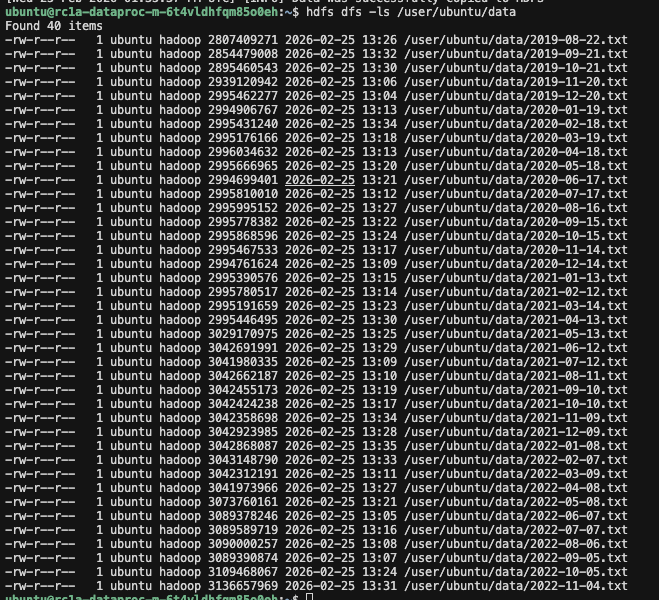

# otus_hw_2
otus ml ops hw 2

## Задание 1–2: S3 Bucket

**Bucket:** otus-bucket-b1gouu7h5gfqm75snu3a  

**Публичный URL:** https://storage.yandexcloud.net/otus-bucket-b1gouu7h5gfqm75snu3a/

## Задание 4:

Содержимое hdfs:
   

